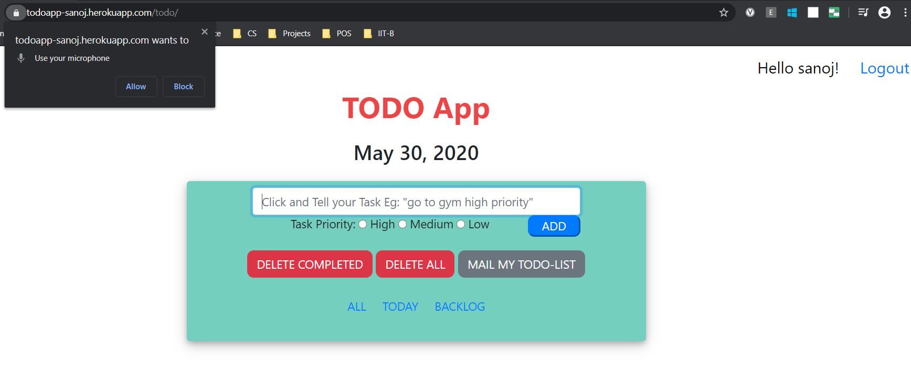
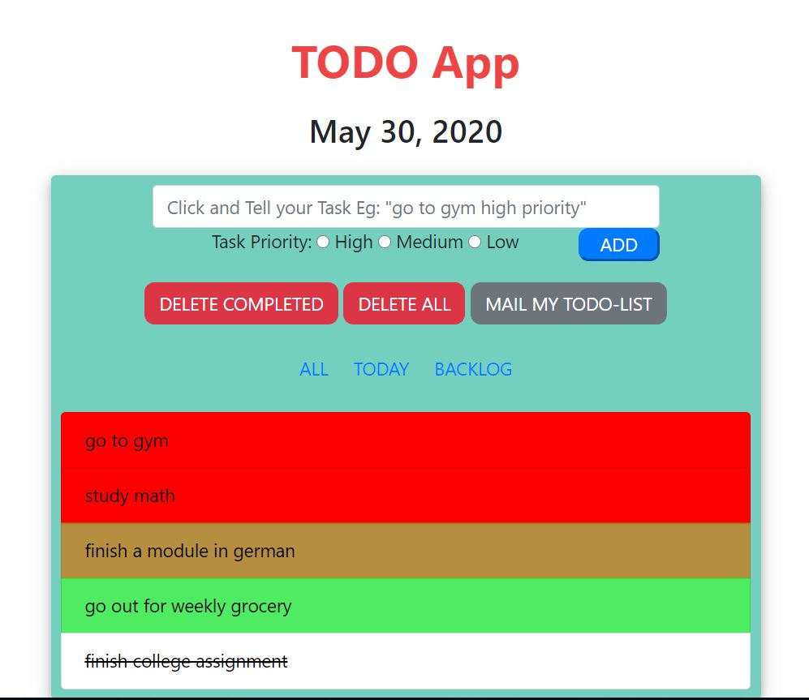
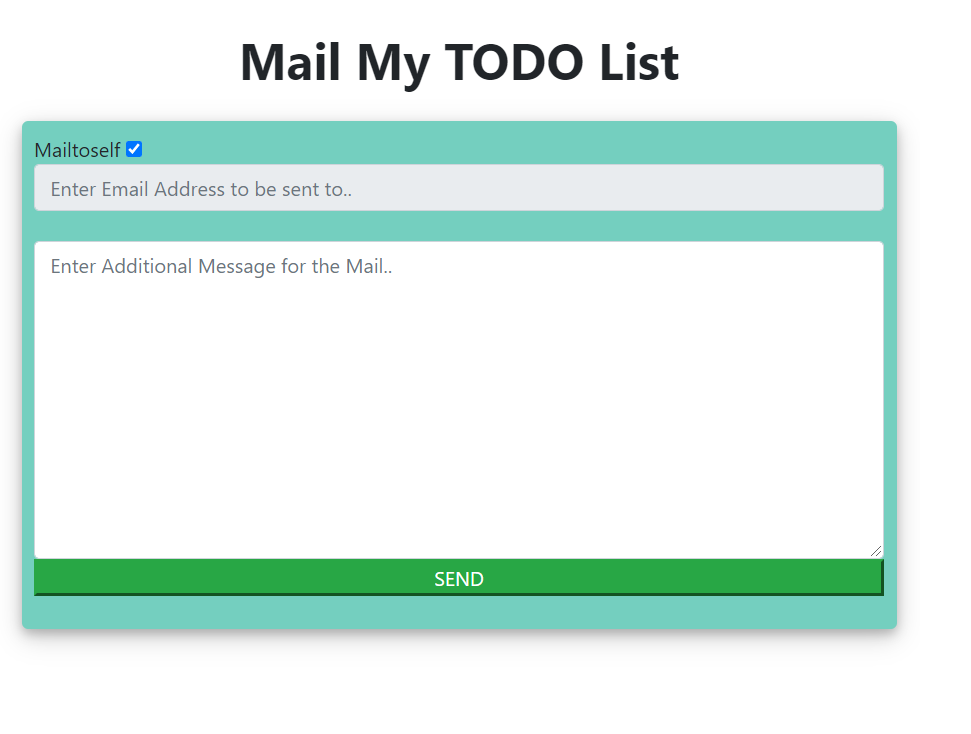

# Todo Application

### Here is the link to the deployed application https://todoapp-sanoj.herokuapp.com/

# Main Features:
  
  ## 1. Voice Input for Task Entry And Automatic Task Priority selection.
  #### Eg:  Speaking "I have to buy pencils low priority" will take "I have to buy pencils" as Text with low priority radio button selected.
  ### This is feature restricted to only chrome browser though.
  
    
  
  
  ## 2. Can view items based on their status.
  
  #### The Tabs All, Today and Backlogs denote all tasks created by user, tasks created today, tasks that user has not completed from yesterday or earlier respectively. at the end of each day the unfinished tasks are moved to backlog while the history of all the tasks is maintained as well.
  
  
  ## 3.Tasks Categorised as High, Medium and Low priority tasks
   #### Completed items are striked out and pushed to the bottom.
   #### while Incomplete tasks are filled with one of red orange green based on their priority level.
  
    
  
 
  
  
  ## 4.Email Functionality:
   #### Can send the list of tasks to anyone or to your Registered Mail ID. Mail to Self disables the Mail address input field.
  
    
  
  ### Mail Received:
    
